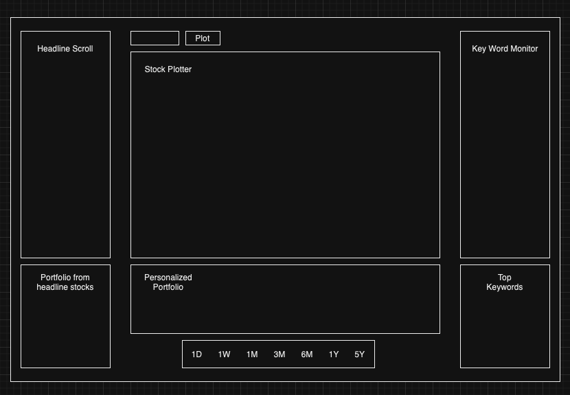

# News-Dashboard

This project is to setup the scripts necessary to extract, transform, and load financial news data and create an analytical dashboard.

# Next Steps

- Pulling Key words from headlines
- Pulling which key words are publicly traded companies
  - Tried implementing a NER trained on labeled news headlines, but no good data exisits, and I don't think it's needed
  - I think I dictionary of companies in snp 500 will do just fine
  - Maybe it's fine to companies and aliases for snp 500
- Train sentiment model to analyze sentiment of headlines for column in data
- Pushing transformed data to cloud db
- Create script to auto pull from API every 1 hours, update db based on new headlines

- Create dashboard with newly updated data

# Dashboard gui design

