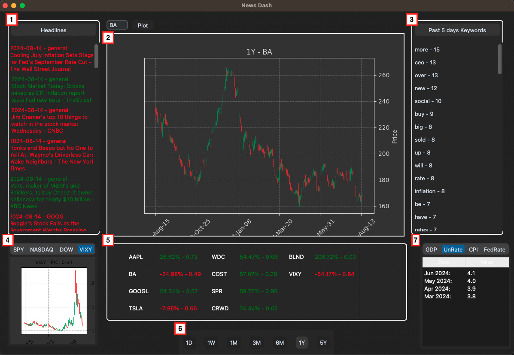
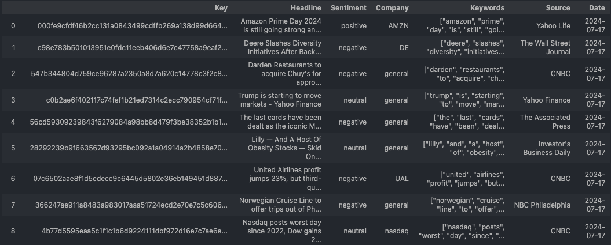
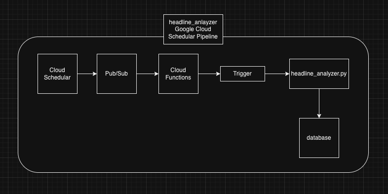

# News-Dashboard

This project is to setup the scripts necessary to extract, transform, and load financial news data and create an analytical dashboard.

# Capabilities

### In progress

### Finished Capabilites

- Extract transform and upload digested financial news data

  - Pull headline data from NewsAPI
  - Digest and upload to SQL db in Google Cloud
  - Key | Headline | Sentiment | Company | Keywords | Source | Date

- Train and implement a sentiment model to analyze sentiment of headlines

- headline_analyzer folder will contain all the necessary code to package and implement to a cron job in google cloud

- Once data is uploaded, dashboard just needs to pull and process the data in order to summarize

- Analyze Keywords column to analyze latest keyword trends

- Stock data will be pulled from yfinance and alpaca api to update tracked stocks on the dashboard

  - YF is used for daily data while alpaca is better for 2D - 5Yr, without a subscription we can't pull current day data from alpaca

- FED data is scraped from https://fred.stlouisfed.org/series/{series_id}

- Analyze Keywords column to analyze latest keyword trends

- Grab major indices and calculate their 3M return and Put/Call ratio and place in bottom left window

# Dashboard gui design

# Finalized gui design and walkthrough

1. Latest 50 major headlines analyzed for sentiment and pulled topic stock (if applicable)
2. Plot area to type in tickers and analyze overall signal
3. Past 5 days keywords is pulled from major headline keywords and counted
4. Plots the 3 month signal and put call ratio of major indices
5. Portfolio return and put/call ratio display

- Update the portfolio stocks within config.py

6. Timeframe adjuster

- Updates both plot area and portfolio return window

7. Fed indicators last 4 quarters

# Headline Data ETL Script

This script is meant to:

- Pull top headlines from news API
- Setup sentiment model and analyze sentiment of each headline
- Serialize raw headlines to create keys (used to check for duplicates)
- Pull headline source
- Pull headline date
- Collect key words
- Parse these key words for companies mentioned
- Upload data to sql db

# Headline Data Pipeline in Google Cloud

This portion is meant to go over how to setup a google cron job in order to force the collection of data at certain set intervals.

1. Create Google Cloud Storage Buckets

- bucket for model
- bucket for data
- bucket for actual headline analyzer script

2. Create a pub/sub topic

- create new topic

3. Create a cloud function

- setup new function
- select the pub/sub trigger and point to newly created topic
- for code you can utilize the new bucket that contains zip of script
- deploy script

- tips:
  - Do not zip the folder, zip the contents together
    - It won't be able to find the main function
  - Add 2 input parameters to main function (data=None, content=None)
  - Watch out for invisible folders like \_\_pycache\_\_ or \_MACOSX this can cause issues, below command helps remove these
    - > zip -r headline\*analyzer_v2.zip . -x "\*/\\.\*" -x "\*/\_\_MACOSX/\*" -x '.DS_Store' -x '\*/\_\_pycache\_\_/\*'

4. Create cloud schedular

- create new job
- set frequency to 0 8,17 \* \* \* (everday at 8am and 5pm)
- choose the pub/sub topic

5. Force the cloud schedular to debug

- ensure the script is working by forcing the cloud schedular
